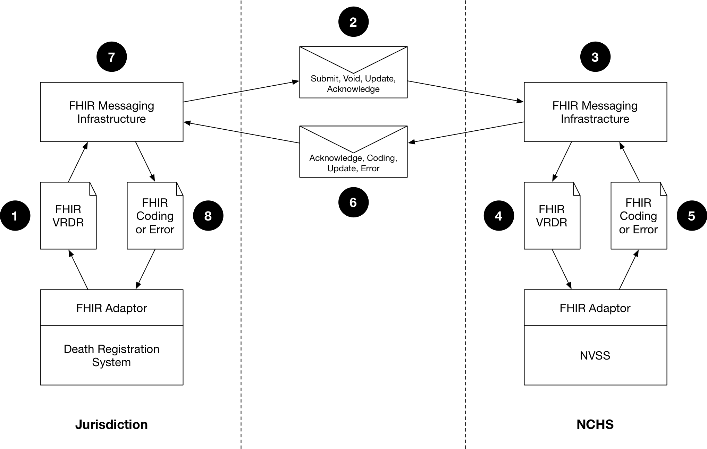
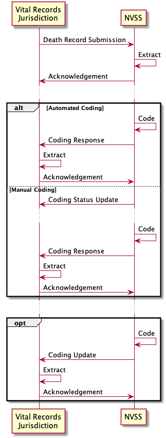
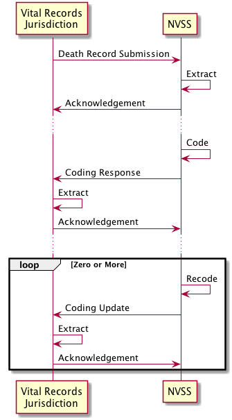
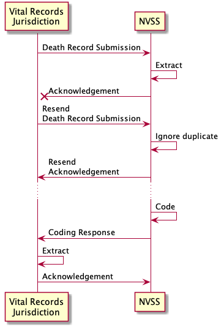
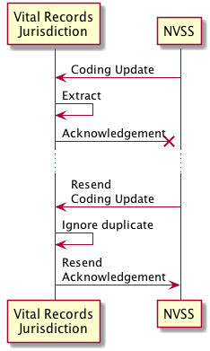
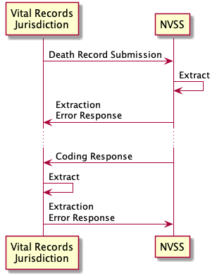

# Introduction

Vital records jurisdictions submit information on deaths in their jurisdiction to the U.S. National Center for Health Statistics (NCHS). For each submission, NCHS codes all causes of death, races, and ethnicities and returns the information to the submitter.

The [Vital Records Death Reporting (VRDR) FHIR IG](http://hl7.org/fhir/us/vrdr/2019May/Introduction.html) specifies how to represent the information sent from vital records jurisdictions to NCHS using FHIR documents. It does not specify how such data is exchanged nor how the coding information is represented and returned to the submitter.

[FHIR Messaging](http://hl7.org/fhir/messaging.html) defines how to use FHIR in a message exchange scenario. This document describes the use of FHIR Messaging for:

1. Submission of VRDR documents from vital records jurisdictions to NCHS, and
2. Return of coded causes of death, race, and ethnicity information from NCHS to vital records jurisdictions.

Questions or comments regarding this document should be directed to the ["Death on FHIR" zulip stream](https://chat.fhir.org/#narrow/stream/179301-Death-on.20FHIR)[^1]. This document will evolve in response to community feedback as well as changes to the VRDR IG or business requirements.

[^1]: https://chat.fhir.org/#narrow/stream/179301-Death-on.20FHIR

# Requirements

## Performance Expectations

Historical data shows that NCHS receives up to 7M unique records per year across all areas of vital records reporting. However, the same record can be submitted more than 3 times per year resulting in 21M submissions per year. Submissions are not linearly distributed over the year and there are peaks of up to 350k submissions per day, of which 25% are new. In response, NCHS can send up to 500k return records per day. Approximately 60% of records represent mortality data.

While the majority of submissions can be coded automatically, some will require nosologist intervention for manual coding. This will require asynchrony between submission and the return of coding information.

## Death Report Submission

Vital records jurisdictions need a mechanism to submit VRDR Death Certificate Documents to NCHS. Vital records jurisdictions should not be required to wait for a death report submission to be acknowledged or coded before submitting additional death reports, there may be many outstanding death report submissions at any time.

Vital records jurisdictions need a mechanism to update VRDR Death Certificate Documents previously submitted to NCHS and this should not rely on patient matching algorithms but instead use embedded identifiers for record correlation.

Vital records jurisdictions need a mechanism to void a single or a block of death certificates. Voiding may target previously submitted documents or may be used to inform NCHS that a specific set of certificate numbers will not be used in the future.
 
## Coding Response

NCHS needs a mechanism to send coded causes of death as well as coded race and ethnicity information to vital records jurisdictions in response to receipt of a VRDR Death Certificate Document. NCHS also needs a mechanism to update previously-sent coding information. Causes of death codings may be sent separately from race and ethnicity codings. Updates to either may also be sent separately.

The underlying cause of death along with contributing causes of death are coded along two axes: record and entity. Each [`Cause Of Death Condition`](http://hl7.org/fhir/us/vrdr/2019May/CauseOfDeathCondition.html) resource in the submitted [`VRDR Death Certificate Document`](http://hl7.org/fhir/us/vrdr/2019May/DeathCertificateDocument.html) may result in multiple codes as described in the [current TRANSAX format](https://www.cdc.gov/nchs/data/dvs/2003trx.pdf)).

The race and ethnicity information in the submitted [`VRDR Death Certificate Document`](http://hl7.org/fhir/us/vrdr/2019May/DeathCertificateDocument.html) can result in multiple race and ethnicity codes in the coding response. The structure of the information returned is described in [NCHS Procedures for Multiple-Race and Hispanic Origin Data: Collection, Coding, Editing, and Transmitting](https://www.cdc.gov/nchs/data/dvs/Multiple_race_documentation_5-10-04.pdf).

## Delivery Status

Vital records jurisdictions need a mechanism to determine that submissions to NCHS, such as VRDR Death Certificate Documents, were successfully received by NCHS. NCHS needs a mechanism to determine that data returned to vital records jurisdictions, such as causes of death coding and race and ethnicity coding, were successfully received by vital records jurisdictions.

## Reliability

NCHS and vital records jurisdictions need a mechanism to automatically recover from messages that are lost during exchange in either direction.

## Error Reporting

NCHS needs a mechanism to report errors to vital records jurisdictions in response to receipt of VRDR Death Certificate Documents that could not be processed. Vital records jurisdictions need a mechanism to report errors to NCHS in response to coded causes of death, race, and ethnicity that could not be processed.

# FHIR Messaging

As described earlier, the [Vital Record Death Reporting (VRDR) FHIR IG](http://hl7.org/fhir/us/vrdr/STU1) specifies how to represent the information sent from vital records jurisdictions to NCHS using FHIR documents. However, it does not specify the mechanism that is used to exchange those FHIR documents, nor how the coded response is represented and returned to the submitter. This document describes the use of FHIR Messaging to accomplish this essential function. [FHIR Messaging](http://hl7.org/fhir/messaging.html) defines:

1. A standard [MessageHeader](http://hl7.org/fhir/messageheader.html) resource that captures common message metadata including
    a. An id that is useful for correlating requests and replies,
    b. Source and sender information that is useful for addressing replies,
    c. Destination information that is useful for routing,
    d. Event information that is useful for capturing the reason that a message was created, and
    e. Information about the subject or topic of the message that is useful for providing context.

2. Patterns for synchronous and asynchronous exchange of messages.

3. A standard FHIR process message operation and an alternate pattern for exchange of messages using the FHIR REST API for messaging.

5. A pattern for reliable message exchange over unreliable channels.

The remainder of this document describes how these capabilities can be applied to submission of death records to NCHS and the return of coded cause of death, race and ethnicity information to vital records jurisdictions.

## High Level Architecture

{ width=80% }

Figure 1 illustrates the high level components of a FHIR messaging based NVSS:

- __Death Registration System__: Jurisdiction systems that process death records

- __FHIR Adaptor__: Functionality to convert between native data formats and FHIR representations of that data

- __FHIR Messaging Infrastructure__: Functionality to:
  - Package payloads in FHIR messages
  - Send and receive FHIR messages
  - Extract payloads from FHIR messages
  - Acknowledge receipt of FHIR messages
  - Report errors if FHIR messages are malformed

- __NVSS__: NCHS systems for processing and coding death reports

- __FHIR VRDR__: A FHIR document formatted according to the [Vital Record Death Reporting (VRDR) FHIR IG](http://hl7.org/fhir/us/vrdr/2019May/Introduction.html) 

- __FHIR Coding or Error__: A FHIR representation of either:
  - Causes of death coding, races and ethnicities coding, or both
  - An error that occurred when processing a FHIR message or its contents

The flow of information is illustrated using numbered steps as follows:

1. A jurisdiction death registration system generates a death report that is mapped to a FHIR VRDR document by a FHIR adaptor and submitted to the FHIR messaging infrastructure for delivery to NCHS.

2. The FHIR messaging infrastructure wraps the VRDR document in a FHIR message and sends it to the NCHS FHIR messaging infrastructure.

3. The NCHS FHIR messaging infrastructure validates the syntax of the received FHIR message and extracts the VRDR document. The NCHS FHIR messaging infrastructure does one of:
    a. Acknowledges the message in the case that the VRDR document could be extracted successfully, or
    b. Reports an error in the case that the VRDR document could not be extracted successfully.

4. The NCHS FHIR messaging infrastructure submits the VRDR document to NVSS for processing. The NVSS FHIR adaptor converts the VRDR document into the desired internal format for processing.

5. NVSS analyzes the death report:
    a. If the death report can be processed, NVSS codes the cause of death and races and ethnicities of the decedent and generates one or two responses^[Cause of death coding can be undertaken separately to race and ethnicity coding and responses for the two activities can be delivered separately.] for delivery to the jurisdiction.
    b. If the death report cannot be processed, NVSS generates an error report response.
    c. In either case the NVSS FHIR adaptor maps the response to FHIR and submits it to the NCHS FHIR messaging infrastructure for delivery.

6. The NCHS FHIR messaging infrastructure wraps the response in a FHIR message and sends it to the jurisdiction FHIR messaging infrastructure.

7. The jurisdiction FHIR messaging infrastructure acknowledges the coded response or error report

8. The jurisdiction FHIR messaging infrastructure unwraps the content of the message and submits it to the jurisdiction death registration system whose FHIR adaptor converts it into the required internal format for processing.

The above sequence describes the general process for exchange of information between vital records jurisdictions and NCHS. Section 4 (below) describes more specific information exchanges for various success and failure scenarios.

Note that the FHIR messaging infrastructure is logically separated from both NVSS and jurisdiction death registration systems and it is this system that provides reliable delivery of death reports and coded responses (or errors) between jurisdictions and NVSS. The mechanics of reliable delivery (acknowledgements and retransmissions) are largely hidden from NVSS and jurisdiction death registration systems.

# Message Exchange Patterns

The following subsections illustrate message exchange patterns between vital records jurisdictions and NVSS. The structure and content of the messages exchanged is described in section 5. Note that the interactions illustrate patterns of message exchange between jurisdiction and NCHS FHIR Messaging Infrastructure as shown in figure 1. Interactions between jurisdiction FHIR Messaging Infrastructure and other jurisdiction systems, or between NCHS FHIR Messaging Infrastructure and other NCHS systems, are not shown.

## Successful Death Record Submission

{ width=40% }

Figure 2 illustrates the normal sequence of message exchanges between a vital records jurisdiction and NVSS. The extract step ensures that the submitted death record is in a format suitable for processing, no in-depth validation is expected at this point. The code step includes in-depth validation and coding of the death record.

The time between the Death Record Submission and Acknowledgement is expected to be relatively short (see additional discussion in [Retrying Requests](#retries)), the time until the Coding Response is sent could be significant if manual intervention is required.

The second (optional) Code, Coding Update, Extract and Acknowledgement steps highlight that cause of death coding may be undertaken separately to race and ethnicity encoding. A single Death Record Submission message could result in both a  Coding Response and a Coding Update message, one for cause of death, the other for race and ethnicity coding. The first coding for a given record should be sent using a Coding Response message, subsequent codings for the same record should be sent using a Coding Update message. For brevity, this separation of coding for causes of death and race and ethnicity is omitted from subsequent diagrams but should be considered to be possible in all cases.

The purpose of acknowledgement messages is to support reliability in the exchange of death records and coding responses, see [Retrying Requests](#retries) for further details. Acknowledgements are a feature of the FHIR messaging system, they are not intended to be exposed to jurisdiction death registration systems or NVSS directly.

## Updating Prior Death Record Submission

{ width=40% }

Figure 3 illustrates the sequence of message exchanges between a vital records jurisdiction and NVSS when an initial submission needs to be subsequently updated. The initial submission of a new record should use a Death Record Submission message, subsequent updates should use a Death Record Update message.

As shown in figure 3, depending on timing (whether coding was complete prior to submission of the Death Record Update), the initial submission may result in a Coding Response or not. If a Coding Response is sent prior to the Death Record Update then a Coding Update will be sent following the Death Record Update.

## Updating Prior Coding Response

{ width=40% }

Figure 4 illustrates the sequence of message exchanges between a vital records jurisdiction and NVSS when a prior Coding Response needs to be subsequently updated.

## Voiding Death Records

{ width=40% }

Figure 5 illustrates the sequence of message exchanges between a vital records jurisdiction and NVSS when an initial submission needs to be subsequently voided. Depending on timing, the initial submission may result in a Coding Response or not.

Records can also be pre-voided to inform NCHS that a specific set of certificate numbers will not be used in the future. This would just require the final three steps of figure 5: "Death Record Void", "Extract" and "Acknowledgement".

## Retrying Requests {#retries}

{ width=40% }

Figure 6 illustrates the case where the vital records jurisdiction does not receive a timely Acknowledgement to the Death Record Submission. Submissions can be retried providing the restrictions on Message and Header ids described in section 5 are followed.

It is recommended that retries follow an "exponential backoff" approach where the time between retries is increased for each retry of a given message. This approach prevents retries from overloading NVSS in the case of transient outages.

{ width=40% }

Figure 7 illustrates the case where the vital records jurisdiction does not receive a Coding Response. NVSS will not receive the expected Acknowledgement and this will trigger resending of the Coding Response.

{ width=40% }

Figure 8 illustrates the case where the Acknowledgement of a Coding Update message is not received by NVSS. NVSS resends the Coding Update message, the jurisdiction resends the Acknowledgement and ignores the duplicate message.

### Acknowledgement Timeout Considerations

The appropriate time to wait for an acknowledgement depends on several factors including the underlying mechanism for message exchange. E.g. an implementation based on polling for messages would have to factor in the interval between polls since that sets a lower bound on the time to wait for acknowledgements.

## Message Extraction Failures

{ width=40% }

Figure 9 illustrates two message extraction failures:

1. A Death Record Submission could not be extracted from the message and an Extraction Error Response is returned instead of an Acknowledgement.
2. A Coding Response could not be extracted from the message and an Extraction Error Response is returned instead of an acknowledgement.

For a given Death Record Submission or Coding Response:

- Extraction Error Response and Acknowledgment are mutually exclusive
- An acknowledged Death Record Submission or Coding Response can still result in issues later in the process that might require manual intervention

In either scenarion, the recipient of the Extraction Error Response would need to investigate the cause of the failure using the information provided in the Extraction Error Response message.

# Message Structure and Content

The following subsections describe the structure and content of each of the messages used in the patterns described in section 4.

## Common Structure

All messages defined in the specification share the following common elements. Specific messages include additional elements as described in the following subsections.

    Message [FHIR Bundle]
    |
    -- entry
        |
        -- Header [FHIR MessageHeader]
        |
        -- Record [FHIR Parameters]
        
`Message` property values:

- `type` is fixed to `message`
- `id` is unique for every message. The same value should be re-used for retransmissions of the same message.
- `timestamp` captures the time the message was created.

`Header` property values:

- `id` is unique for every message. The same value should be re-used for retransmissions of the same message.
- `eventUri` identifies the type of message, specific values for each type of message are provided in the subsections describing that message.
- `destination.endpoint` identifies the destination FHIR messaging endpoint and is fixed to `http://nchs.cdc.gov/vrdr_submission` (a URI that uniquely identifies the NCHS death record submission service) for messages sent to NVSS. Note that this URI does not need to be resolvable and is only used for logical identification purposes.
- `source.endpoint` identifies the source FHIR messaging endpoint and is fixed to `http://nchs.cdc.gov/vrdr_submission` (a URI that uniquely identifies the NCHS death record submission service) for messages originating from NVSS. Like `destination.endpoint`, this URI is a logical identifier and does not need to be resolvable.
- `focus` references the payload of the message, all messages will include a reference to the `Record` entry, some messages include additional references to other entries and these are defined in the following subsections.

Note that, for each message type, `Message.id` and `Header.id` are used at the FHIR Messaging layer to identify retransmissions and to correlate acknowledgements and responses to the submissions and updates that initiated them.

`Record` property values:

- `parameter.name` of `jurisdiction_id` with a `valueString` that contains a 2 letter vital record jurisdiction identifier.
- `parameter.name` of `cert_no` with a `valueUnsignedInt` that contains the death certificate number
- `parameter.name` of `death_year` with a `valueUnsignedInt` that contains the four digit year of death
- `parameter.name` of `state_auxiliary_id` with a `valueString` that contains the state auxiliary identifier

## Death Record Submission and Update

    Message [FHIR Bundle]
    |
    -- entry
        |
        -- Header [FHIR MessageHeader]
        |
        -- Record [FHIR Parameters]
        |
        -- VRDR Death Certificate Document [FHIR Bundle]

Additional and specific `Header` property values:

- `eventUri` is one of:
  * `http://nchs.cdc.gov/vrdr_submission` - indicates that the payload is an initial (or retransmission of an unacknowledged) submission of a VRDR Death Certificate Document
  * `http://nchs.cdc.gov/vrdr_submission_update` indicates that the payload is an update to a previously acknowledged submission of a VRDR Death Certificate Document
- `focus` includes a reference to the VRDR Death Certificate Document bundle

## Death Record Void

    Message [FHIR Bundle]
    |
    -- entry
        |
        -- Header [FHIR MessageHeader]
        |
        -- Record [FHIR Parameters]

Specific `Header` property values:

- `eventUri` is `http://nchs.cdc.gov/vrdr_submission_void` indicating that the payload identifies a previously acknowledged submission of a VRDR Death Certificate Document that should be voided (e.g. as a duplicate)

Additional `Record` parameters:

- `parameter.name` of `block_count` with a `valuePositiveInt` that contains the number of records to void starting at the certificate number specified by the `cert_no` parameter. If not present a default value of `1` is assumed, meaning only a single record will be voided. Acks of void messages with a `block_count` should include the `block_count` as well.

## Acknowledgement

    Message [FHIR Bundle]
    |
    -- entry
        |
        -- Header [FHIR MessageHeader]
        |
        -- Record [FHIR Parameters]

Additional and specific `Header` property values:

- `eventUri` is fixed to `http://nchs.cdc.gov/vrdr_acknowledgement`
- `destination.endpoint` is the value of the `Header.source.endpoint` property of the message that is being acknowledged
- `response.identifier` is the value of the `Header.id` property of the message that is being acknowledged
- `response.code` is fixed to `ok`

Additional `Record` parameters:

- For void message acknowledgements, `parameter.name` of `block_count` with a `valuePositiveInt` that contains the number of records voided starting at the certificate number specified by the `cert_no` parameter.

## Coding Response and Coding Update

    Message [FHIR Bundle]
    |
    -- entry
        |
        -- Header [FHIR MessageHeader]
        |
        -- Record [FHIR Parameters]

Additional and specific `Header` property values:

- `eventUri` is one of
  * `http://nchs.cdc.gov/vrdr_coding` to identify the initial coding response to a Death Record Submission or Update
  * `http://nchs.cdc.gov/vrdr_coding_update` to identify updates to a prior Coding Response
- `destination.endpoint` is the value of the `Header.source.endpoint` property of the message that is being acknowledged
- `source.endpoint` is fixed to `http://nchs.cdc.gov/vrdr_submission`

A coding response or coding update may contain cause of death coding information, race and ethnicity coding information or both. A complete example is included in section 6.
Additional Optional `Record` parameters:

- `rec_mo` is a `valueUnsignedInt` representing the month which NCHS received the record.
- `rec_dy` is a `valueUnsignedInt` representing the day which NCHS received the record.
- `rec_year` is a `valueUnsignedInt` representing the year which NCHS received the record.
- `cs` is a `valueCoding` containing a valid code from Page 23 of the [PC-ACME/TRANSAX](https://ftp.cdc.gov/pub/Health_Statistics/NCHS/Software/MICAR/Data_Entry_Software/ACME_TRANSAX/Documentation/auser.pdf) user guide.
- `ship` is a `valueString` containing an AlphaNumeric NCHS shipment number. Usually the month of death or month of receipts.
- `sys_rej` is a `valueString` containing a valid code from [System Reject Codes (NCHS)](https://phinvads.cdc.gov/vads/ViewValueSet.action?id=CFF72380-C37E-4947-A809-43B00ACB1EF9) with all whitespaces and dashes removed. For example: "MICAR Reject - Dictionary Match" should be "MICARRejectDictionaryMatch". A full list of strings can also be found in the [VRDR library](https://github.com/nightingaleproject/vrdr-dotnet/blob/8becd63/VRDR.Messaging/CodingResponseMessage.cs#L352-L362).
- `int_rej` is a `valueCoding` containing a one-character reject codes from the [Instructions for Classifying Multiple Causes OF Death](https://www.cdc.gov/nchs/data/dvs/2b_2017.pdf) code document for values.

A coding response or coding update may contain cause of death coding information, race and ethnicity coding information, manner of death coding information, place of injury coding information, or some combination of all four types of information. A complete example is included in section 6.

### Race and Ethnicity Coding

Additional `Record` property values for race and ethnicity coding:

- One `parameter.name` of `ethnicity` with one or two `part` entries, each with
  + `part.name` of `DETHNICE` or `DETHNIC5C`
  + `part.valueCoding` containing a `code` from [NCHS Hispanic Codes](https://www.cdc.gov/nchs/data/dvs/HispanicCodeTitles.pdf)
- One `parameter.name` of `race` with one or more `part` entries, each with
  + `part.name` of `RACE1E`..`RACE8E` or `RACE16C`..`RACE23C` or `RACEBRG`
  + `part.valueCoding` containing a race `code` from [NCHS Race Codes](https://www.cdc.gov/nchs/data/dvs/RaceCodeList.pdf) or a bridge code (`RACEBRG` only) from [NCHS Bridge Codes](https://www.cdc.gov/nchs/data/dvs/Multiple_race_documentation_5-10-04.pdf).

### Causes of Death Coding

Additional `Record` property values for causes of death coding:

- One `parameter.name` of `underlying_cause_of_death` with a `valueCoding` that contains the code for the underlying cause of death. Note that `valueCoding` includes an optional `display` field that can be used to transmit the text description of the assigned code - this will not be populated.
- One `parameter.name` of `record_cause_of_death` with one or more `part` entries, each with
  + `part.name` of `coding` with a `valueCoding` that contains a coding of a cause of death. Note that `valueCoding` includes an optional `display` field that can be used to transmit the text description of the assigned code - this will not be populated.
- Zero or more `parameter.name` of `entity_axis_code`, each with:
  + `part.name` of `lineNumber` with a `valueString` containing a value between 1 and 6 that codes the line number of the death certificate that corresponds to the axis entry:
    - __1__: Part I, Line A
    - __2__: Part I, Line B
    - __3__: Part I, Line C
    - __4__: Part I, Line D
    - __5__: Part I, Line E
    - __6__: Part II
  + One or more `part.name` of `coding` with a `valueCoding` that specify the codes assigned to the axis entry. The order of these codes corresponds to the order of the concepts in the text. Note that `valueCoding` includes an optional `display` field that can be used to transmit the text description of the assigned code - this will not be populated.

### Manner of Death Coding

The manner of death is represented by a field called `manner`. This field should contain a valid `valueString` from the list of values provided in the [VRDR library](https://github.com/nightingaleproject/vrdr-dotnet/blob/8becd63d901c0870cd2cc9c3040947d7da1125a6/VRDR.Messaging/CodingResponseMessage.cs#L293-L305).

### Place of Injury Coding

The Place of Injury field is represented by two fields, a `injpl` field containing a valid `valueString` from the [ICD-10 Place of Occurrence](https://phinvads.cdc.gov/vads/ViewCodeSystem.action?id=2.16.840.1.114222.4.5.320) Code System. All `/` should be replaced with `Or`, and all `,` and `<space>` characters should be removed. Example: "Street/Highway" should be "StreetOrHighway". A full list of strings can also be found in the [VRDR library](https://github.com/nightingaleproject/vrdr-dotnet/blob/8becd63d901c0870cd2cc9c3040947d7da1125a6/VRDR.Messaging/CodingResponseMessage.cs#L293-L305).

There is an additional optional field, `other_specified_place`, which can be set if `injpl` is set. `other_specified_place` is a freeform `valueString` containing any location value.

## Extraction Error Response

    Message [FHIR Bundle]
    |
    -- entry
        |
        -- Header [FHIR MessageHeader]
        |
        -- Record [FHIR Parameters]
        |
        -- Details [FHIR OperationOutcome]

Additional and specific `Header` property values:

- `eventUri` is fixed to `http://nchs.cdc.gov/vrdr_extraction_error` and indicates that an error occurred during processing
- `destination.endpoint` is the value of the `Header.source.endpoint` property of the message that caused the error
- `response.identifier` is the value of `Header.id` from the message that caused the error
- `response.code` is fixed to `fatal-error`
- `response.details` is a reference to the `Details` entry in the bundle

`Details` property values:

- One or more `issue` elements, each containing:
  * `severity` from [issue-severity value set](http://hl7.org/fhir/valueset-issue-severity.html)
  * `code` from [issue-type value set](http://hl7.org/fhir/valueset-issue-type.html)
  * `diagnostics` is a human-readable description of the issue
  
# Examples

## Message

All messages share a common outer structure as shown below:

```json
{
  "resourceType": "Bundle",
  "type": "message",
  "id": "93b3153f-0e15-49dd-8fe2-5c074d7e7dba",
  "timestamp": "2019-11-05T17:09:33.239Z",
  "entry": [
    ...
  ]
}
```

Each message has additional components that are embedded within the `entry` array. All messages include a `Record` entry as follows:

```json
{
  "resourceType": "Parameters",
  "id": "e1c5eb7a-730f-440f-9b4e-c5d15a1b981c",
  "parameter": [
    {
      "name": "jurisdiction_id",
      "valueString": "NH"
    },
    {
      "name": "cert_no",
      "valueUnsignedInt": 123456
    },
    {
      "name": "death_year",
      "valueUnsignedInt": 2018
    },
    {
      "name": "state_auxiliary_id",
      "valueString": "abcdef10"
    }
  ]
}
```

The following subsections provide examples of additional components for each message type.

## Death Record Submission

### Header

```json
{
  "resourceType": "MessageHeader",
  "id": "54a07cef-4bff-4bb0-8957-9c8fbf7390ed",
  "eventUri": "http://nchs.cdc.gov/vrdr_submission",
  "destination": [
    {
      "endpoint": "http://nchs.cdc.gov/vrdr_submission"
    }
  ],
  "source": {
    "endpoint": "https://sos.nh.gov/vital_records"
  },
  "focus": [
    {
      "reference": "Parameters/e1c5eb7a-730f-440f-9b4e-c5d15a1b981c"
    },
    {
      "reference": "Bundle/36b8cb04-0668-4b8e-8e13-210ee88bc9c2"
    }
  ]
}
```

Where `e1c5eb7a-730f-440f-9b4e-c5d15a1b981c` is the `id` of the `Record` entry and `36b8cb04-0668-4b8e-8e13-210ee88bc9c2` is the `id` of the VRDR Death Certificate Document `Bundle`.

A Death Record Update message has the same structure, the only difference being that the `eventUri` value is `http://nchs.cdc.gov/vrdr_submission_update`.

### VRDR Death Certificate Document

See [example](http://hl7.org/fhir/us/vrdr/2019May/DeathCertificateDocument.html) in the VRDR implementation guide.

## Acknowledgement

### Header

```json
{
  "resourceType": "MessageHeader",
  "id": "1ab16ba8-ce5b-4c28-b8d0-6679cd81f3e2",
  "eventUri": "http://nchs.cdc.gov/vrdr_acknowledgement",
  "destination": [
    {
      "endpoint": "https://sos.nh.gov/vital_records"
    }
  ],
  "source": {
    "endpoint": "http://nchs.cdc.gov/vrdr_submission"
  },
  "response": {
    "identifier": "54a07cef-4bff-4bb0-8957-9c8fbf7390ed",
    "code": "ok"
  },
  "focus": [
    {
      "reference": "Parameters/e1c5eb7a-730f-440f-9b4e-c5d15a1b981c"
    }
  ]
}
```

Note that the `response.identifier` is the value of the `MessageHeader.id` for the message that is being acknowledged. In this case the value corresponds to the `MessageHeader.id` of the Death Record Submission message in the previous example.

## Coding Response

### Header

```json
{
  "resourceType": "MessageHeader",
  "id": "097b6785-c36b-47f5-b6ce-d258eeea5429",
  "eventUri": "http://nchs.cdc.gov/vrdr_coding",
  "destination": [
    {
      "endpoint": "https://sos.nh.gov/vital_records"
    }
  ],
  "source": {
    "endpoint": "http://nchs.cdc.gov/vrdr_submission"
  },
  "focus": [
    {
      "reference": "Parameters/e1c5eb7a-730f-440f-9b4e-c5d15a1b981c"
    }
  ]
}
```

### Record for Cause of Death Coding

Given an input Cause of Death:

- Part I, Line A: MULTI ORGAN SYSTEM FAILURE
- Part I, Line B: ACUTE RESPIRATORY FAILURE, SHOCK, RENAL FAILURE
- Part I, Line C: SEPSIS (SEPTIC SHOCK)
- Part I, Line D: PNEUMONIA
- Part II (Other Significant Conditions): CLOSTRIDIUM DIFFICILE COLITIS

Assuming NVSS produced the following coding:

Underlying COD:

- A047 "Enterocolitis due to Clostridium difficile"

Place of Injury:

- Other Specified Place

Record Axis Codes:

- A047 "Enterocolitis due to Clostridium difficile"
- A419 "Sepsis, unspecified organism"
- J189 "Pneumonia, unspecified organism"
- J960 "Acute respiratory failure"
- N19 "Unspecified kidney failure"
- R579 "Shock, unspecified"
- R688 "Other general symptoms and signs"

Entity Axis Codes:

- R688 "Other general symptoms and signs" (line 1, position 1)
- J960 "Acute respiratory failure" (line 2, position 1)
- R579 "Shock, unspecified" (line 2, position 2)
- N19 "Unspecified kidney failure" (line 2, position 3)
- A419 "Sepsis, unspecified organism" (line 3, position 1)
- J189 "Pneumonia, unspecified organism" (line 4, position 1)
- A047 "Enterocolitis due to Clostridium difficile" (line 6, position 1)

This would be represented as follows.

```json
{
  "resourceType": "Parameters",
  "id": "e1c5eb7a-730f-440f-9b4e-c5d15a1b981c",
  "parameter": [
    {
      "name": "jurisdiction_id",
      "valueString": "NH"
    },
    {
      "name": "cert_no",
      "valueUnsignedInt": 123456
    },
    {
      "name": "death_year",
      "valueUnsignedInt": 2018
    },
    {
      "name": "rec_mo",
      "valueUnsignedInt": 12
    },
    {
      "name": "rec_dy",
      "valueUnsignedInt": 1
    },
    {
      "name": "rec_yr",
      "valueUnsignedInt": 2018
    },
    {
      "name": "cs",
      "valueCoding": {
        "system": "https://ftp.cdc.gov/pub/Health_Statistics/NCHS/Software/MICAR/Data_Entry_Software/ACME_TRANSAX/Documentation/auser.pdf",
        "code": "8"
      }
    },
    {
      "name": "ship",
      "valueString": "B201901"
    },
    {
      "name": "sys_rej",
      "valueString": "NotRejected"
    },
    {
      "name": "injpl",
      "valueString": "OtherSpecifiedPlace"
    },
    {
      "name": "other_specified_place",
      "valueString": "Unique Location"
    },
    {
      "name": "state_auxiliary_id",
      "valueString": "abcdef10"
    },
    {
      "name": "underlying_cause_of_death",
      "valueCoding": [
        {
          "system": "http://hl7.org/fhir/ValueSet/icd-10",
          "code": "A04.7"
        }
      ]
    },
    // Record Axis Codes
    {
      "name": "record_cause_of_death",
      "part": [
        {
          "name": "coding",
          "valueCoding": [
            {
              "system": "http://hl7.org/fhir/ValueSet/icd-10",
              "code": "A04.7"
            }
          ]
        },
        {
          "name": "coding",
          "valueCoding": [
            {
              "system": "http://hl7.org/fhir/ValueSet/icd-10",
              "code": "A41.9"
            }
          ]
        },
        {
          "name": "coding",
          "valueCoding": [
            {
              "system": "http://hl7.org/fhir/ValueSet/icd-10",
              "code": "J18.9"
            }
          ]
        },
        {
          "name": "coding",
          "valueCoding": [
            {
              "system": "http://hl7.org/fhir/ValueSet/icd-10",
              "code": "J96.0"
            }
          ]
        },
        {
          "name": "coding",
          "valueCoding": [
            {
              "system": "http://hl7.org/fhir/ValueSet/icd-10",
              "code": "N19"
            }
          ]
        },
        {
          "name": "coding",
          "valueCoding": [
            {
              "system": "http://hl7.org/fhir/ValueSet/icd-10",
              "code": "R57.9"
            }
          ]
        },
        {
          "name": "coding",
          "valueCoding": [
            {
              "system": "http://hl7.org/fhir/ValueSet/icd-10",
              "code": "R68.8"
            }
          ]
        }
      ]
    },
    // Entity Axis Codes
    {
      "name": "entity_axis_code",
      "part": [
        {
          "name": "lineNumber",
          "valueString": "1"
        },
        {
          "name": "coding",
          "valueCoding": [
            {
              "system": "http://hl7.org/fhir/ValueSet/icd-10",
              "code": "R68.8"
            }
          ]
        }
      ]
    },
    {
      "name": "entity_axis_code",
      "part": [
        {
          "name": "lineNumber",
          "valueString": "2"
        },
        {
          "name": "coding",
          "valueCoding": [
            {
              "system": "http://hl7.org/fhir/ValueSet/icd-10",
              "code": "J96.0"
            }
          ]
        },
        {
          "name": "coding",
          "valueCoding": [
            {
              "system": "http://hl7.org/fhir/ValueSet/icd-10",
              "code": "R57.9"
            }
          ]
        },
        {
          "name": "coding",
          "valueCoding": [
            {
              "system": "http://hl7.org/fhir/ValueSet/icd-10",
              "code": "N19"
            }
          ]
        }
      ]
    },
    {
      "name": "entity_axis_code",
      "part": [
        {
          "name": "lineNumber",
          "valueString": "3"
        },
        {
          "name": "coding",
          "valueCoding": [
            {
              "system": "http://hl7.org/fhir/ValueSet/icd-10",
              "code": "A41.9"
            }
          ]
        }
      ]
    },
    {
      "name": "entity_axis_code",
      "part": [
        {
          "name": "lineNumber",
          "valueString": "4"
        },
        {
          "name": "coding",
          "valueCoding": [
            {
              "system": "http://hl7.org/fhir/ValueSet/icd-10",
              "code": "J18.9"
            }
          ]
        }
      ]
    },
    {
      "name": "entity_axis_code",
      "part": [
        {
          "name": "lineNumber",
          "valueString": "6"
        },
        {
          "name": "coding",
          "valueCoding": [
            {
              "system": "http://hl7.org/fhir/ValueSet/icd-10",
              "code": "A04.7"
            }
          ]
        }
      ]
    }
  ]
}
```

Note that the above example does not include an `entity_axis_code` entry with a `lineNumber` of `5` since that line (Part I, Line E) was not populated in the death certificate.

### Record for Race and Ethnicity Coding

```json
{
  "resourceType": "Parameters",
  "id": "e1c5eb7a-730f-440f-9b4e-c5d15a1b981c",
  "parameter": [
    {
      "name": "jurisdiction_id",
      "valueString": "NH"
    },
    {
      "name": "cert_no",
      "valueUnsignedInt": 123456
    },
    {
      "name": "death_year",
      "valueUnsignedInt": 2018
    },
    {
      "name": "state_auxiliary_id",
      "valueString": "abcdef10"
    },
    {
      "name": "ethnicity",
      "part": [
        {
          "name": "DETHNICE",
          "valueCoding": [
            {
              "system": "https://www.cdc.gov/nchs/data/dvs/HispanicCodeTitles.pdf",
              "code": "221"
            }
          ]
        }
      ]
    },
    {
      "name": "race",
      "part": [
        {
          "name": "RACE1E",
          "valueCoding": [
            {
              "system": "https://www.cdc.gov/nchs/data/dvs/RaceCodeList.pdf",
              "code": "608"
            }
          ]
        },
        {
          "name": "RACEBRG",
          "valueCoding": [
            {
              "system": "https://www.cdc.gov/nchs/data/dvs/Multiple_race_documentation_5-10-04.pdf",
              "code": "15"
            }
          ]
        }
      ]
    }
  ]
}
```

If both race and ethnicity coding and causes of death coding are present in the same message then the two `parameter` arrays are simply combined and only a single `jurisdiction_id`, `cert_no`, `death_year` and `state_auxiliary_id` are included.

## Death Record Void

### Header

```json
{
  "resourceType": "MessageHeader",
  "id": "58e2bc21-5266-4d03-914f-69c31ceb6570",
  "eventUri": "http://nchs.cdc.gov/vrdr_submission_void",
  "destination": [
    {
      "endpoint": "http://nchs.cdc.gov/vrdr_submission"
    }
  ],
  "source": {
    "endpoint": "https://sos.nh.gov/vital_records"
  },
  "focus": [
    {
      "reference": "Parameters/e1c5eb7a-730f-440f-9b4e-c5d15a1b981c"
    }
  ]
}
```

### Record

```json
{
  "resourceType": "Parameters",
  "id": "e1c5eb7a-730f-440f-9b4e-c5d15a1b981c",
  "parameter": [
    {
      "name": "jurisdiction_id",
      "valueString": "NH"
    },
    {
      "name": "cert_no",
      "valueUnsignedInt": 123456
    },
    {
      "name": "death_year",
      "valueUnsignedInt": 2018
    },
    {
      "name": "state_auxiliary_id",
      "valueString": "abcdef10"
    },
    {
      "name": "block_count",
      "valuePositiveInt": 10
    }
  ]
}
```

The above would void a block of records starting with certificate number 123456 and ending with certificate number 123465 inclusive (10 records total).

## Extraction Error Response

### Header

```json
{
  "resourceType": "MessageHeader",
  "id": "4f257f5d-d30c-4b87-a045-55fbfce83ef4",
  "eventUri": "http://nchs.cdc.gov/vrdr_extraction_error",
  "destination": [
    {
      "endpoint": "https://sos.nh.gov/vital_records"
    }
  ],
  "source": {
    "endpoint": "http://nchs.cdc.gov/vrdr_submission"
  },
  "response": {
    "identifier": "54a07cef-4bff-4bb0-8957-9c8fbf7390ed",
    "code": "fatal-error",
    "details": "OperationOutcome/ce028490-5e55-4673-8a80-a71c97e23fa0"
  },
  "focus": [
    {
      "reference": "Parameters/e1c5eb7a-730f-440f-9b4e-c5d15a1b981c"
    }
  ]
}
```

### Details

```json
{
  "resourceType": "OperationOutcome",
  "id": "ce028490-5e55-4673-8a80-a71c97e23fa0",
  "issue": [
    {
      "severity": "error",
      "code": "structure",
      "diagnostics": "Expected 1 or more Cause of Death Condition resources, received 0."
    }
  ]
}
```

# Open Questions and Additional Considerations

This section captures open questions and issues.

## Bulk Submissions

While the message exchange patterns included in this document focus on individual message exchanges, it would be possible to batch messages together to reduce the number of transfers. E.g. a single transfer from a vital records jurisdiction to NCHS could batch together a set of death record submissions, and acknowledgements for previously received coding response messages. On receipt, NVSS could process each individual message in the batch and create a new batch to  return to the jurisdiction.
